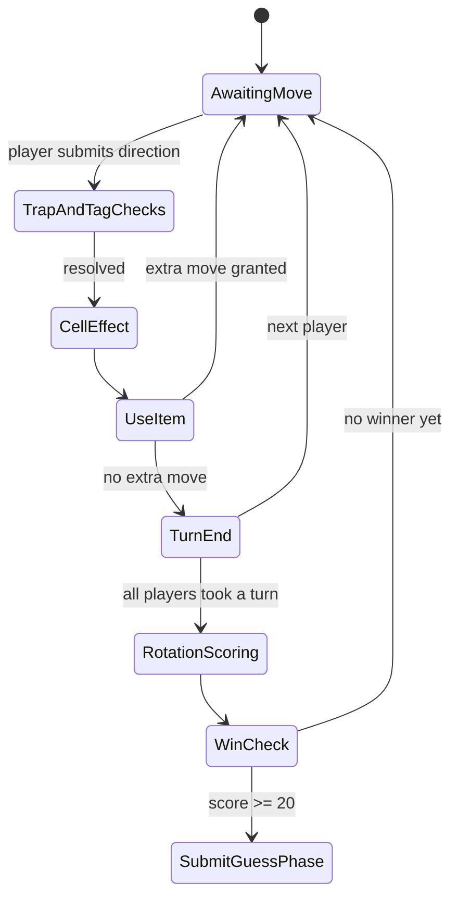

# Overview

Players join a game of tag played in a grid-like map. However none of them know how does the grid look like, or where the other players are. In the start of the game one of the players is assigned as the tag and can tag another player by standing in the same cell of the grid as them, which will teleport them to a random cell. At the end of each rotation (every player completed their turn), every player who is not the tag will increase their score by one unit.

# Map Grid

The map grid will consist of at most of a 5x5 grid. Each cell can have one of six types:
- Gold: Gives 5 gold. 1-2 cell.
- Shop: Allows players to buy items from the shop with gold. 2-3 cells
- Good: Spin the lucky wheel. 1-3 cells
- Bad: Spin the unlucky wheel. 3-5 cells
- Teleport: Teleports to a random cell in the map. 1 cell
- Blank: Does nothing

Each cell can also have multiple arrows that serve as a path to cells nearby. An arrow can be placed in the eight directions, up, down, left, right, top-left, top-right, bottom-left, bottom-right. The four cardinal positions arrows can be poiting to the same cell that it is leaving. When an arrow is going outside the map, for example when a cell in the bottom row has an arrow pointing down, that arrow is supposed to show up in the oposite side of the map, in this example, making it connect to any cell in the top row. This kind of arrows need to have a color associated, and each cell can only have one arrow per cardinal point.

One random cell will be initialized as the starting point. Players will spawn randomly at the start of the game, but the starting point is where they will teleport to when they are sent to spawn.

# Objective

When one of the players reaches a score of 20, the game ends. The players final score will be the sum of its current score plus the amount of elements that a player can discover about the map, where each element correctly pointed will give 0.2 points. The player with more final points wins the game.

# Shop

Players have four slots where they can hold their items. Items can be used right after being bought.
Items list:
- Compass: See adjacent cells categories and current cell number.
- Sixth sense: See the direction of the tagged player if not tagged or the direction to the closer player if tagged.
- Hawk eye: Shortest path to a player. User must chose the target.
- Clone: Creates a clone that looks like it is a player.
- Witch: Teleport a player to another space.
- Needy: Teleport an adjacent cell of a random player.
- Horse: Move to another cell in this turn.
- Trap: Steals 3 gold when another player steps on it. Player's gold can go below zero.

# Lucky wheel

- Double your gold
- Steal one gold from each player
- Gain 3 gold
- Free item
- Move another space
- Spin unlucky wheel

# Unlucky wheel

- Teleport to start
- Give 2 gold to each player
- Lose 3 gold
- If not tagged, tag will know a path to you. If you are tagged, all players will know a path that leads to you.
- Two extra spins.

# Move order

1. Check if tagged is there
   - Gets tagged, teleported, and back to 1.
2. Check if is tagged and is there someone there
   - tag person, teleport person, apply 1 for person
   - apply 3 for tagger
3. Cell category effect
4. Use items
5. Move
6. Use items

